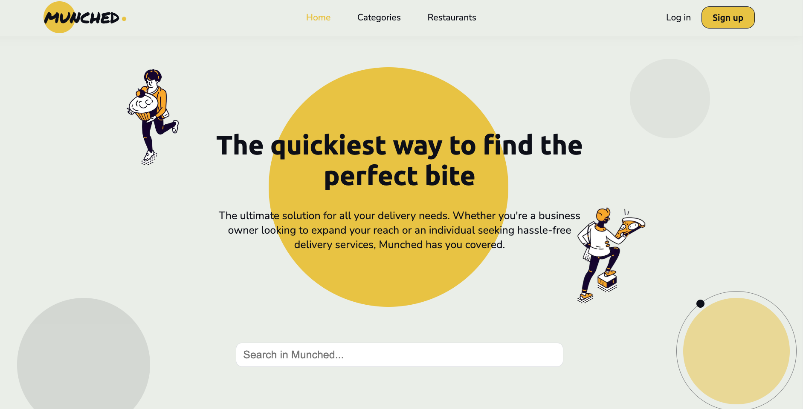

# Delivery Application with Next.js

This is a [Next.js](https://nextjs.org/) project bootstrapped with [`create-next-app`](https://github.com/vercel/next.js/tree/canary/packages/create-next-app). It allows users to order food from nearby restaurants by either creating a user account or entering their information manually. After users create their accounts, they can monitor their personal information as well as their favorite places under the profile section. The order confirmation page and order status page have been added without payment options since it's a portfolio project without any commercial usage.

### Screenshots from App



## Getting Started

These instructions will allow you to get a copy of the project and running on your local machine for development and testing purposes.

### Prerequisites

- Node.js (16.14) or later.
- An editor; you can use either Visual Code or Android Studio.
- macOS, Windows (including WSL), and Linux are supported.

1. Clone the repository to your local machine:

```bash
git clone git@github.com:alper-savas/munched-delivery-app.git
```

2. Navigate to the project directory:

```bash
cd /your/path/to/the/local/repository
```

3. Run the development server:

```bash
npm run dev
# or
yarn dev
# or
pnpm dev
```

Open [http://localhost:3000](http://localhost:3000) with your browser to see the result.

You can start editing the page by modifying `pages/index.js`. The page auto-updates as you edit the file.

[API routes](https://nextjs.org/docs/api-routes/introduction) can be accessed on [http://localhost:3000/api/hello](http://localhost:3000/api/hello). This endpoint can be edited in `pages/api/hello.js`.

## 3rd Party Libraries, Tools & Packages Used

- [Redux Toolkit](https://redux.js.org/redux-toolkit/overview) - Store overall app state and order state.
- [bycryptjs](https://www.npmjs.com/package/bcryptjs) - Store hashed values of user passwords.
- [MongoDB](https://www.mongodb.com/) - Store user data.
- [NextAuth.js](https://next-auth.js.org/) - Enable user authentication.
- [React Multi Carousel](https://www.npmjs.com/package/react-multi-carousel) - Carousel Component.
- [React Paginate](https://www.npmjs.com/package/react-paginate) - Pagination Component.
- [React Search Autocomplete](https://www.npmjs.com/package/react-search-autocomplete) - Seach Bar Component.
- [UUID](https://www.npmjs.com/package/react-uuid) - Generate unique id.

## Folder Structure


## Link to a Deployed Site on Vercel

[Munched Delivery App](https://munched-delivery-app.vercel.app/)
